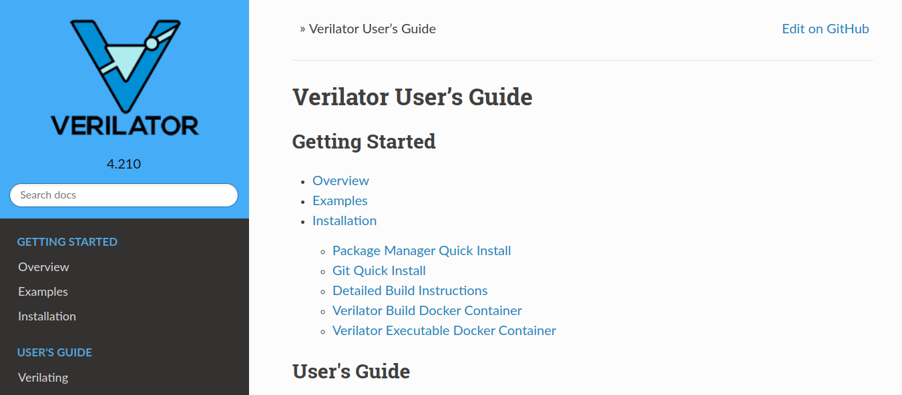
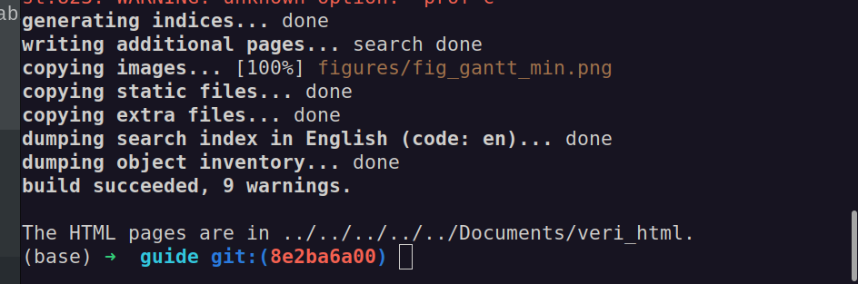

# Verilator_4.210_Users_Guide

**Note**: compiled by `@exaithrg`

**Verilator Project Templates**: [Verilator Templates](https://github.com/exaithrg/verilator_templates)

Verilator 4.210 User’s Guide Verilator 4.210 Manual

**Based on Verilator Source Code**: https://github.com/verilator/verilator

## How to use `verilator_4.210_Users_Guide`

just double-click `index.html`



## How to install verilator 4.210

```bash
verilator --version
Verilator 4.210 2021-07-07 rev v4.210

sudo apt-get install git perl python3 make
sudo apt-get install g++  # Alternatively, clang
sudo apt-get install libgz  # Non-Ubuntu (ignore if gives error)【ERROR】
sudo apt-get install libfl2  # Ubuntu only (ignore if gives error)
sudo apt-get install libfl-dev  # Ubuntu only (ignore if gives error)
sudo apt-get install zlibc zlib1g zlib1g-dev  # Ubuntu only (ignore if gives error)【】ERROR
sudo apt-get install ccache  # If present at build, needed for run
sudo apt-get install libgoogle-perftools-dev numactl
sudo apt-get install perl-doc
sudo apt-get install git autoconf flex bison
# Only for verilator developers
sudo apt-get install gdb graphviz cmake clang clang-format-14 gprof lcov
sudo apt-get install yapf3
sudo pip3 install sphinx sphinx_rtd_theme sphinxcontrib-spelling breathe
cpan install Pod::Perldoc
cpan install Parallel::Forker

cd verilator
git pull        # Make sure we're up-to-date
git tag         # See what versions exist
#git checkout master      # Use development branch (e.g. recent bug fix)
#git checkout stable      # Use most recent release
#git checkout v{version}  # Switch to specified release version

autoconf         # Create ./configure script
export VERILATOR_ROOT=`pwd`
pwd=/home/geng/githubrepos/verilator/verilator
./configure      # Configure and create Makefile
make -j `nproc`  # Build Verilator itself (if error, try just 'make')
make test
sudo make install
```


## How to compile Verilator User Guide

```
pip install sphinx_rtd_theme
sphinx-build -b html . ~/Documents/veri_html
mkdir ~/Documents/veri_html
pip install sphinxcontrib-log_cabinet
which sphinx-build
pip install -U Sphinx
conda activate base
```



